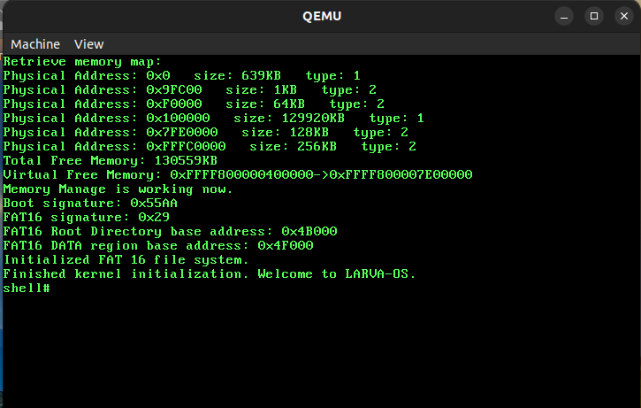
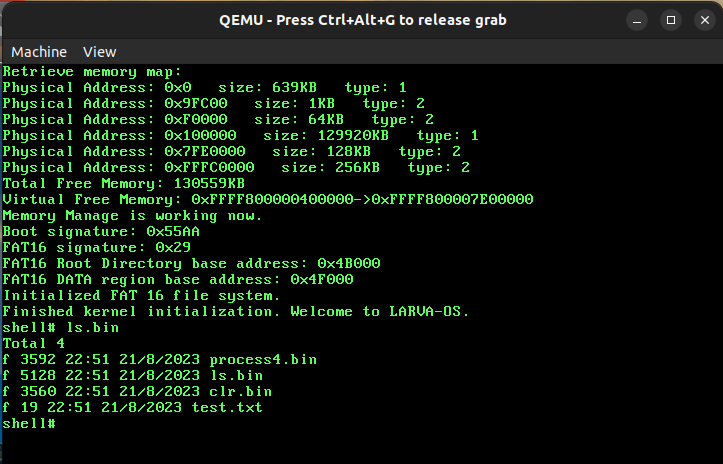
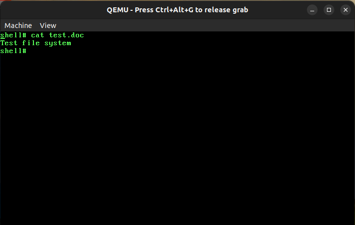
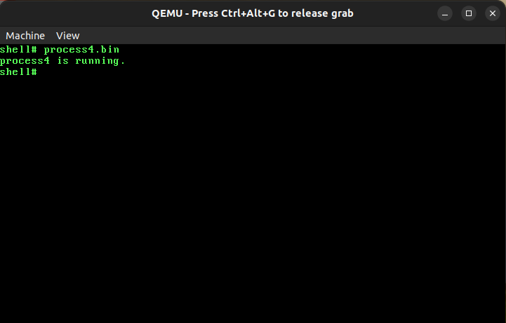

# x86-64 Operating System

An Operating System based on x86-64 architecture.

## 1. Make a blank hard disk image

- Before building our OS and make final image, we need a blank hard disk image, We will use `bximage` to make it with:
  - Size 100 megabytes.
  - Sector size is 512 bytes.
  - Kind of image is `flat`.

- this is done by run [image.sh](image.sh) script, the output image is `boot.img` file.

## 2. Build the OS

- The OS using make to build final image.

## 3. Simulate the OS

- To simulate the OS, we can use Bochs x86 Emulator 2.7, first generate a bochs configuration file (this is done automatically by run [image.sh](image.sh) script). And then, `make` to build our OS. And finally run `bochs` command to start simulating.

- The second option to simulate our OS is using QEMU, after build our OS with `make`, simply run command: `qemu-system-x86_64 -cpu qemu64,pdpe1gb -hda boot.img`

## 4. Mount the OS image to your computer

```bash
mount -t vfat boot.img /mnt/d/
```

## 5. Test the OS

- Build & Mount image to the OS & Running:

```bash
make run
```

- System booting look like:



- List files in root directory with `ls` command:

```shell
ls.bin
```



- You can create, edit, delete files on the image via command in your host, because the image was mounted to `/mnt/d` directory. For example:

```bash
echo "Test file system" > /mnt/d/test.doc
```

- After that check the file content by our OS cat command:

```shell
cat test.doc
```



- And also, you can run binary files by specifying the file name. For example, we need to run `process4.bin` program:

```shell
process4.bin
```



- In addition, we have many features waiting for you to experiment :).

## 6. Test on the real machine

- After build the OS, copy our image to the USB device:

```bash
sudo dd if=boot.img of=/dev/sdb
```

- Plug the USB to your machine, booting it with the USB.

## 7. Building user program

- Please build program with our C/C++ runtime library.
